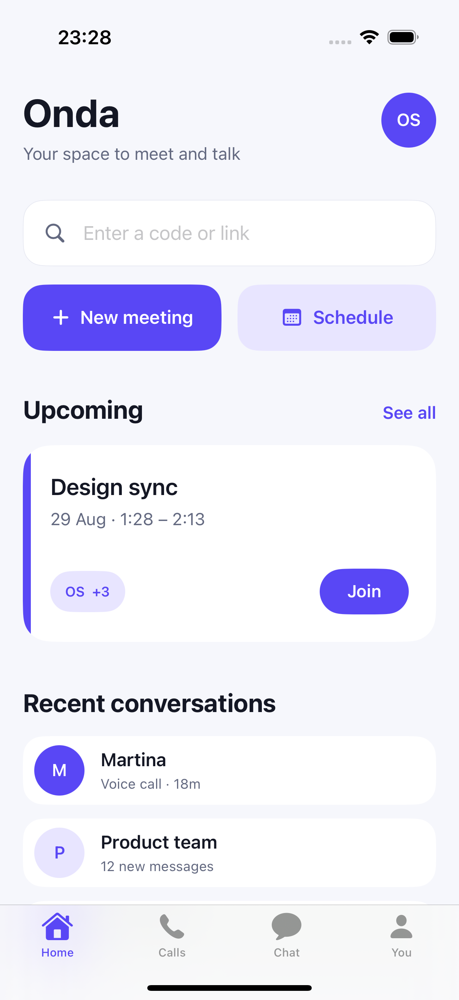
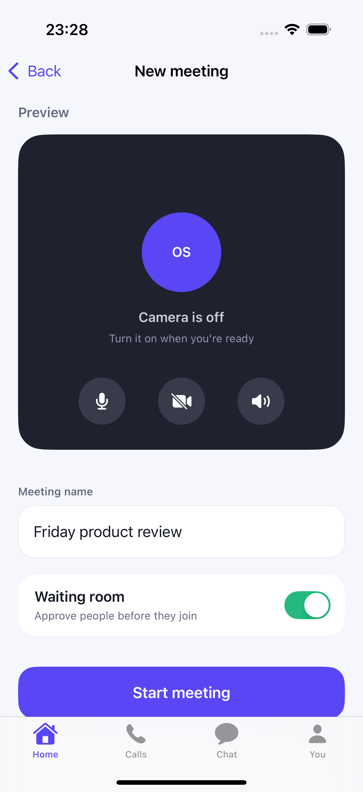
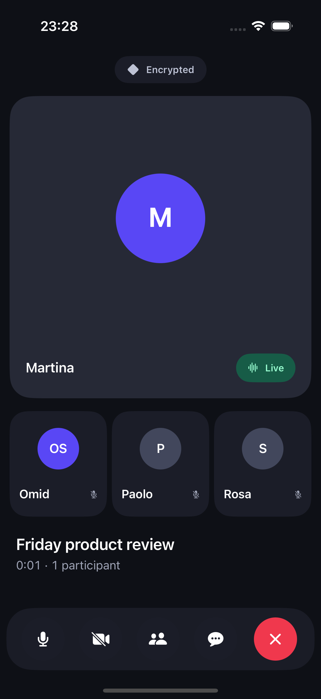
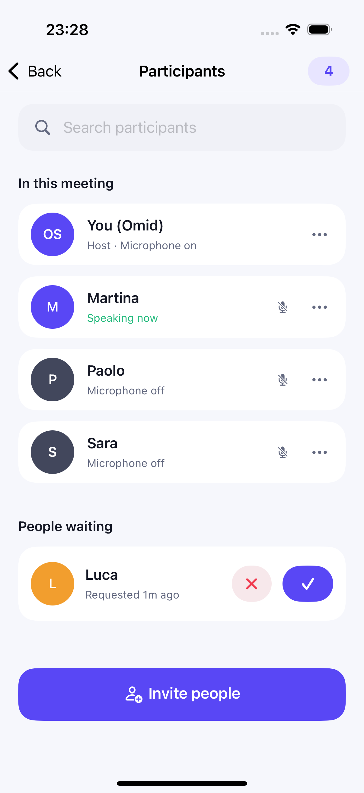
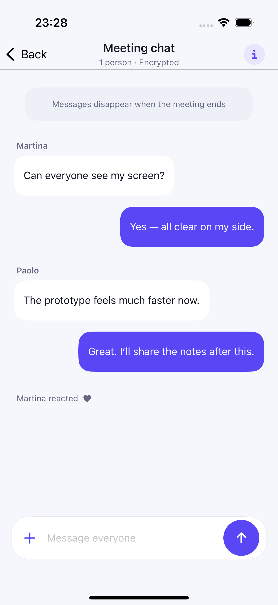
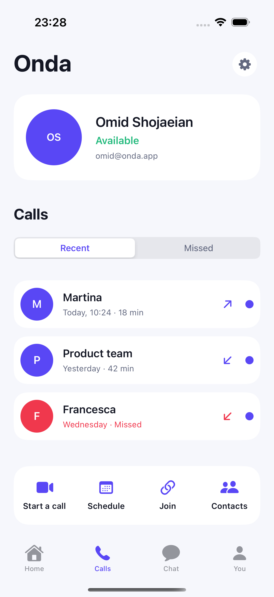
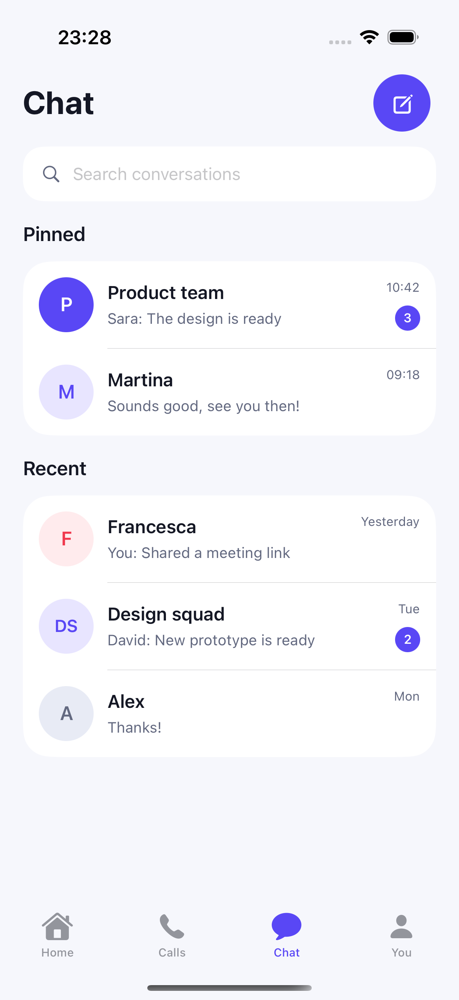
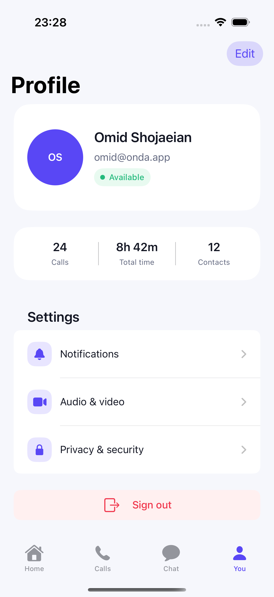

# Onda

Onda is an iOS 17.6+ video-meeting and messaging app built with SwiftUI. The project includes a versioned FastAPI service and an offline-first data path for upcoming meetings.

## Screenshots

<table>
  <tr>
    <td align="center"><strong>Home</strong></td>
    <td align="center"><strong>New meeting</strong></td>
    <td align="center"><strong>Live meeting</strong></td>
    <td align="center"><strong>Participants</strong></td>
  </tr>
  <tr>
    <td></td>
    <td></td>
    <td></td>
    <td></td>
  </tr>
  <tr>
    <td align="center"><strong>Meeting chat</strong></td>
    <td align="center"><strong>Calls</strong></td>
    <td align="center"><strong>Chat list</strong></td>
    <td align="center"><strong>Profile</strong></td>
  </tr>
  <tr>
    <td></td>
    <td></td>
    <td></td>
    <td></td>
  </tr>
</table>

## Implemented engineering scope

- SwiftUI feature screens with type-safe navigation
- MVVM for the Home feature using Combine (`ObservableObject` and `@Published`)
- Protocol-based dependency injection and repository abstraction
- URLSession networking with async/await, typed errors, and Codable DTO mapping
- Core Data cache with background-context reads and writes
- Versioned FastAPI endpoints with generated OpenAPI documentation
- XCTest unit/contract/persistence tests and XCUITest navigation coverage
- GitHub Actions CI for iOS and backend checks

## Run the iOS app

Open `Onda/Onda.xcodeproj`, select the `Onda` scheme, and run on an iOS 17.6+ simulator. The app remains usable when the backend is unavailable by loading Core Data or bundled fallback data.

## Run the backend

```bash
cd backend
python3.12 -m venv .venv
source .venv/bin/activate
python -m pip install -e '.[dev]'
uvicorn app.main:app --reload
```

Open `http://127.0.0.1:8000/docs` for Swagger UI.

## Documentation

- [Architecture](docs/ARCHITECTURE.md)
- [Job-alignment matrix](docs/JOB_ALIGNMENT.md)
